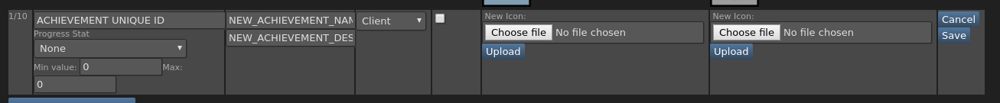

---
layout: post
title: Integrating Steamworks And Achievements Into Unity
tags: [unity, tutorial, steam]
comments: true
---

I've just added achievements to my game [Layers](http://store.steampowered.com/app/661330/Layers/) and thought I would write a quick guide on how I did it as I haven't posted anything in awhile.

## Adding the Steamworks package

1. Go to https://github.com/rlabrecque/Steamworks.NET/releases and download the latest release,  make sure you download the .unitypackage. You will then need to import this into your Unity project.

2. In the root of your project folder open the steam_appid.txt file and replace the 480 with your Steam AppId. Relaunch Unity.

3. On your initial scene, create a new game object, call it something like "Steam Manager" and add the SteamManager.cs script found in Scripts>Steamworks.NET

That's all you need to integrate Steamworks into your project. Just make sure the Steam client is running in the background you should be able to hit play in the editor and have no errors.

## Achievements

Adding achievements is really simple.

1. Create the achievement in the [Steamworks web portal](https://partner.steamgames.com/)
   .

   The "ACHIEVEMENT UNIQUE ID" is the ID of the achievement that we want to unlock so I tend to call it something that relates to the actual achievement.

2. To unlock an achievement its just this bit of code.
   ```cs
   Steamworks.SteamUserStats.SetAchievement("ACHIEVEMENT UNIQUE ID");
   SteamUserStats.StoreStats();
   ```
   